# Laboratorio Git

1. Primero creamos una carpeta.
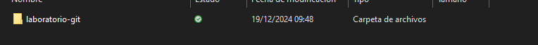

2. Abrimos la carpeta con **"Visual Estudio Code"**.

3. Creamos un archivo **"readme.md"**.

4. Creamos un **"repositorio"** en **"GitHub"**.
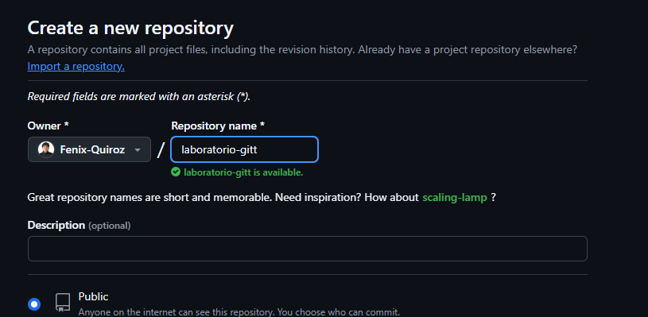

5.  Volvemos al ***Visual Studio Code*** y en la terminal realizamos un **"git init"** , agregamos el archivo ***readme.md*** con **"git add"** ,hacemos un **"commit"** y conectamos con el repositorio que creamos en GitHub haciendo **"git remote add origin"**.
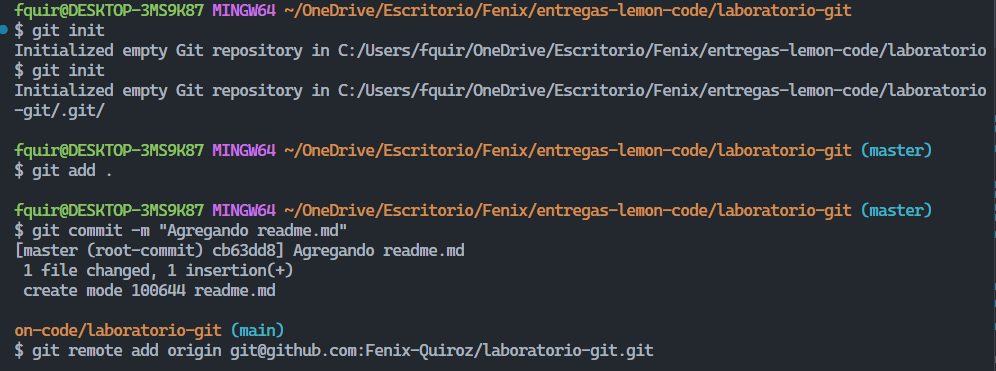

6. Hacemos un **"git push"**.
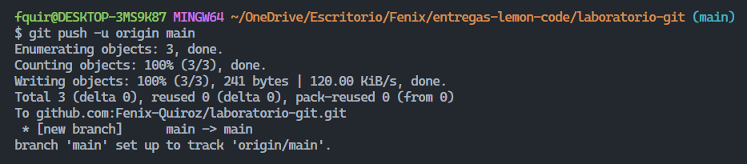

7. Creamos un archivo y agregamos unos **"console.log()"**.
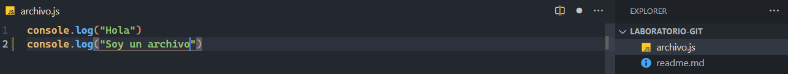

8. Agregamos el nuevo archivo con **"git add"** , hacemos el **"commit"** y un **"git push"** para subir el nuevo archivo al repositorio de **"GitHub"**.
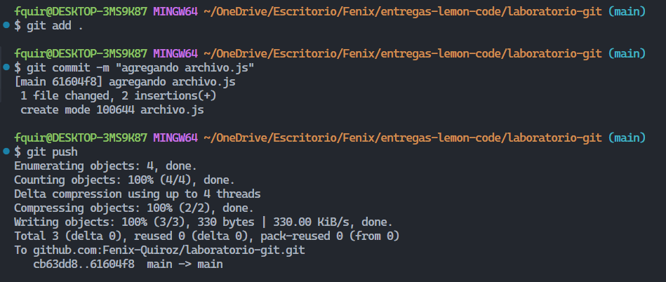

 ### Creando la rama DEVELOPMENT
 1. Creamos la nueva rama con ***"git branch development"*** , cambiamos de la rama **"main"** a la rama **"development"** que acabamos de crear haciendo un ***"git checkout development"***.
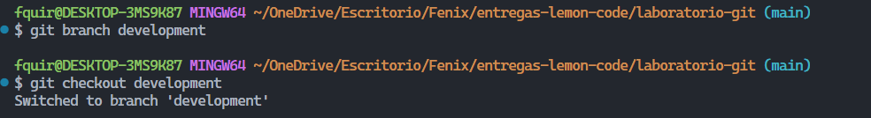

2. Un vez  que cambiamos de rama modificamos el **"arcivo.js"**.
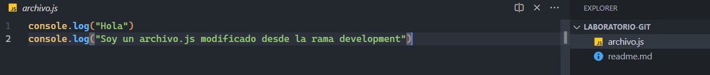

3. Hacemos un **"git add"** y un **"commit"**.
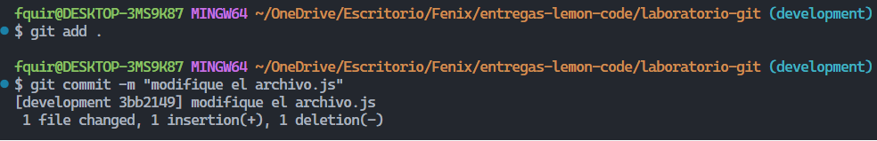

4. Haceamos un ***"git push"*** para subir los cambios de la nueva rama a ***GitHub***.
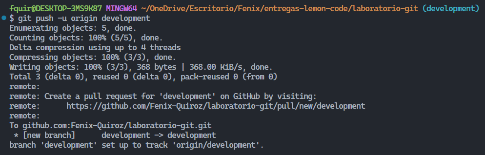

5. Como paso final volvemos a la rama **main**  con ***git checkout main*** y en esa rama hacemos un ***git merge development*** para traernos lo que hicimos en esa rama y tenerlos en **main**.
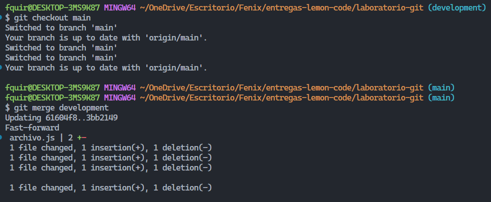

Y finalmente asi quedaría nuestro repositorio en **GitHub**.
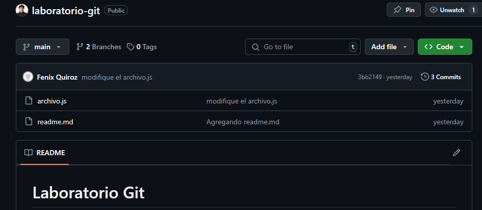